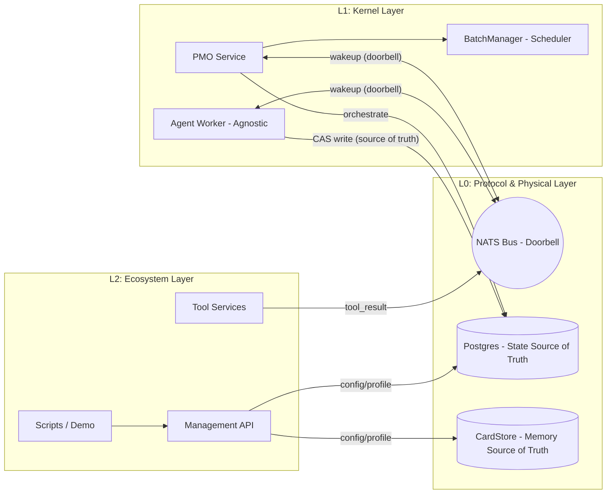

# Common Ground Core (CGC)

> *"Unstructured intelligence is just entropy."*

[](https://www.apache.org/licenses/LICENSE-2.0)
[](https://www.python.org/downloads/)
[](https://nats.io/)
[](https://postgresql.org/)
[](https://discord.com/invite/intelligentinternet)

[中文](README_CN.md) | [English](README.md)


Modern Agent frameworks often rely on rigid static heuristics, lack state tracking and system resilience, and can easily collapse under complex multi-agent delegation scenarios ("Coordination Collapse").

We built a real **Sociotechnical Operating System** called **Common Ground Core**, based on **cybernetics**.

**Freedom at the edges. Constraints at the kernel.**

---

## What is CGC?

CGC is not a single-machine Python library. It is a protocol-first OS kernel that defines physical collaboration laws for agents.

*   **CardBox & Immutable Ledger**
    All communication, reasoning, and tool calls are persisted as immutable cards, creating an unforgeable cognitive lineage. This enables 100% traceable context engineering and anti-contamination.
*   **Worker-Agnostic Execution**
    The L0 protocol and L1 kernel only define the physical rules; they do not care how an agent executes. As long as workers follow the universal tool protocol (UTP) and doorbell contract, you can build bus-mounted workers in any language or LLM framework (such as LangChain/LlamaIndex).
*   **Dynamic Topology**
    We move beyond rigid DAG orchestration. Agents can safely spawn and fork/join hundreds of child nodes through the L1 kernel, while the system automatically handles concurrent convergence.
*   **Humans Are Agents**
    Humans are no longer the top-level prompter. We share the same physical protocol as AI and participate as asynchronous nodes. The system adapts to human cadence, allowing mid-flight intent injection, plan review, and real-time authorization across systems.
*   **Zero-Brain-Split Physical Law (PG + NATS Doorbell)**
    State and signal are fully separated. Postgres acts as the authoritative source of truth enforcing `turn_epoch` CAS locks, while NATS JetStream serves purely as a pure wakeup doorbell. This removes distributed-message reordering issues that cause split-brain states. L1 Watchdog provides built-in deadlock and timeout fallback.

---

## What We Are Building (The OS in Action)

*Internal applications built on the CGC engine are planned for open source release soon:*

1. **Living Sociotechnical Simulation**
   Watch dozens of autonomous agents pulse in real time in a 3D topology UI, form dynamic links, cluster, and evolve. This is pure sociological emergence under strict protocol constraints.
2. **Native Slack Workspace**
   Connect the OS directly to team Slack. Review deep research plans in daily chats and collaborate asynchronously with AI peers in mid-flight.
3. **Vibe-Coded Workspace**
   A real-time co-editing chat app designed by humans and continuously coded by AI. Here AI is a true co-creator, not just a code-completion tool.

---

## ⚠️ Preview Limitations

CGC has a broad vision, but Rome is not built in a day. This release is a **Preview Release**, with a current focus on validating the most fundamental **OS kernel** and underlying physical protocol.

Please note the following limitations before use:

> ⚠️ **Security Warning:** This project is in Preview mode. The API (8099) and NATS (4222/8222/8080) endpoints are unauthenticated and include arbitrary command execution (RCE) capabilities (including sandbox and Skills). Never expose them to public networks (e.g., binding to `0.0.0.0`) in production.

1. **Kernel-First, Lean Components**: The current version only provides a basic Generic Worker and a small set of core demo tools, with primary focus on kernel constraints and basic agent organization patterns.
2. **Protocol in Fast Iteration (`v1r3`)**: Subject naming and payload protocols are currently at `v1r3` and may still have breaking changes before stable `v2`.
   * *(No worry: a coding agent can help you migrate your business quickly.)*
3. **No ACL in This Release**: For local developer convenience, all APIs and NATS interfaces are fully public. Do not expose this directly to public networks.
4. **Sandbox and Skill System (Experimental)**: The platform includes built-in support for E2B/SRT code execution sandboxes and the skill system, but this is still experimental.
5. **Observability (Experimental)**: Topology observability and organizational context management are still being iterated and remain experimental.

---

## Getting Started

Run your multi-agent OS kernel locally in under 5 minutes.

### 1. Prepare Your Environment
*   Docker & Docker Compose
*   A valid `GEMINI_API_KEY` by default; or switch to OpenAI/Kimi (see Quick Start docs for details).

```bash
git clone --recursive https://github.com/Intelligent-Internet/CommonGround.git
cd CommonGround
```

If you already cloned without recursion, run:

```bash
git submodule update --init --recursive
```

### 2. Start All Services At Once (Includes Initialization)

```bash
export GEMINI_API_KEY="your_key"
# Or switch providers directly:
# export CG__JUDGE__MODEL="gpt-5-mini"   # or moonshot/kimi-k2.5
# export MOCK_SEARCH_LLM_PROVIDER="openai"
# export MOCK_SEARCH_LLM_MODEL="gpt-5-mini" # or moonshot/kimi-k2.5
# export OPENAI_API_KEY="..."
# export MOONSHOT_API_KEY="..."
docker compose up -d --build
```

This command automatically starts and initializes:
`nats`, `postgres`, `db-init`, `api`, `pmo`, `agent-worker`, `mock-search`.

### 3. Run Demo (Recommended Inside api Container)
If `uv` is not installed on the host, run inside container:

```bash
docker compose exec api sh -lc '
  export CG_CONFIG_TOML=/app/config.toml
  uv run -m examples.quickstarts.demo_principal_fullflow_api \
    --project "${PROJECT_ID:-proj_mvp_001}" \
    --channel public \
    "help me to do a research on k8s"
'
```

> Note: `/projects/{project_id}/skills:upload` and `/projects/{project_id}/artifacts:upload` require `[gcs]` config. If `gcs.bucket` is missing, the API gracefully disables these endpoints.

### 4. Observability and Report Viewer

`docker compose up -d --build` enables OTel + Jaeger + tracking by default.

- Jaeger UI: `http://127.0.0.1:16686`
- Report Viewer: `http://127.0.0.1:8099/observability/report-viewer/`

In Report Viewer, choose a project at the top and click `Load Project`. Reports are generated by the API and loaded in real time.

> Where is the UI?
> This repository currently ships the OS Kernel (backend engine and communication bus). `UI Worker` and `demo_ui_action.py` show how external frontends connect through the protocol. A ready-to-use web chat UI (Vibe-Coded Workspace) is planned as a separate repo/module in a follow-up release. For now, use CLI, API, and the included demos.

### 5. Next Steps

- [Docker-based full guide and troubleshooting](docs/EN/01_getting_started/docker_quickstart_demo_principal_fullflow_api.md)
- [Local `uv` approach](docs/EN/01_getting_started/quick_start.md) (manual service startup and additional demos)

---

## Architecture Overview

The system uses a clear physical separation of data and control flow:



The CardBox implementation and APIs are maintained in [CG-Cardbox](https://github.com/Intelligent-Internet/CG-Cardbox).

---

## Documentation Index

The docs are organized by **developer cognition depth**. See [`docs/EN/README.md`](docs/EN/README.md):

| Module | Core Content | Audience |
| :--- | :--- | :--- |
| **🧠 Core Concepts** | [Architecture Overview](docs/EN/01_getting_started/architecture_intro.md) \| [Developer Entry](docs/EN/01_getting_started/quick_start.md) | Beginners, architects |
| **🚀 Ecosystem & Development** | [Getting Started](docs/EN/01_getting_started/quick_start.md) \| [Tool Development Guide](docs/EN/02_building_agents/creating_tools.md) | App/tool developers |
| **🧩 CardBox Reference** | [CG-Cardbox Repository](https://github.com/Intelligent-Internet/CG-Cardbox) | Storage layer contributors |
| **⚙️ Kernel Implementation** | [Worker Core Loop](docs/EN/03_kernel_l1/agent_worker.md) \| [Batch Orchestration Engine](docs/EN/03_kernel_l1/batch_manager.md) | System developers |
| **🔬 Physical Protocol** | [State Machine Contracts](docs/EN/04_protocol_l0/state_machine.md) \| [NATS Specification](docs/EN/04_protocol_l0/nats_protocol.md) | Protocol designers, on-call responders |
| **📈 Operations & Observability** | [Performance Tuning](docs/EN/05_operations/performance_tuning.md) \| [OTel Tracing](docs/EN/05_operations/observability.md) | SRE, operations, observability |

---

## Coming Soon

The era of the **Single-player Agent** is over. We are actively pushing these capabilities:

*   **Protocol Network Upgrade**:
    *   More flexible topology primitives, pattern templates, and self-observing/self-optimizing tools to explore the frontier of self-organizing collective intelligence.
    *   More ingress paths: native support for A2A (Agent-to-Agent), ACP, and Simple HTTP access.
    *   Enterprise-grade security: mature multi-tenancy and fine-grained ACL controls.
    *   Official SDKs to reduce cross-language integration costs.
*   **Ready-to-Use UI Demos**:
    *   Open-source the internal UIs we use for day-to-day productivity.
    *   Release "Purely for fun" sociological emergence visualization tools.
*   **Stronger Functions**:
    *   Add more high-intelligence specialized workers.
    *   Deeply integrate and stabilize the Skills and E2B sandbox ecosystems.

---

## Contributing

The future of intelligent agents belongs to a highly structured and resilient human-AI symbiosis. We are evolving AI from isolated thinking loops into a truly operational organization. Community contributions are welcome.

*   Modifying **L2** (tools, configuration, scripts) usually does not require protocol changes.
*   Modifying **L1** (Worker/PMO logic) should preserve the core test paths.
*   Modifying **L0** (protocol/schema) is a breaking change and should start with Issue/RFC discussion.

Please read the repository guide (`AGENTS.md`) before submitting a PR.

## Community & Support

*   **Discord**: [Join our Discord community](https://discord.com/invite/intelligentinternet) for architecture discussion.
*   **GitHub Issues**: Found a bug or have a feature request? Please [open an issue](https://github.com/Intelligent-Internet/CommonGround/issues).

## License

Common Ground is open sourced under the [Apache 2.0 License](https://www.apache.org/licenses/LICENSE-2.0), as specified in the [`LICENSE`](./LICENSE) file.
