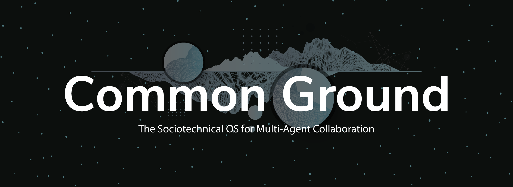
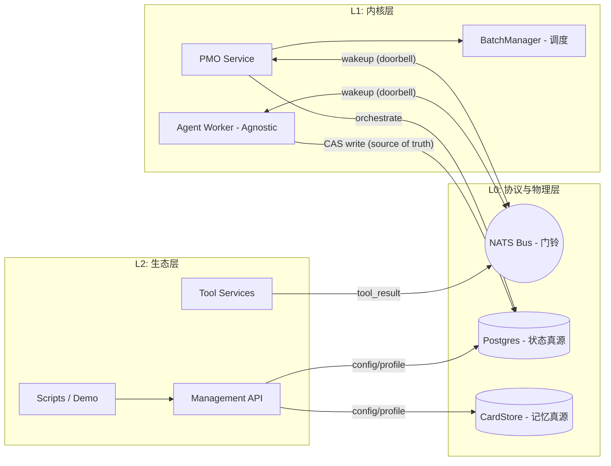

# Common Ground Core (CGC)

> *"未经结构化的智能只是熵。" (Unstructured intelligence is just entropy.)*

[](https://www.apache.org/licenses/LICENSE-2.0)
[](https://www.python.org/downloads/)
[](https://nats.io/)
[](https://postgresql.org/)
[](https://discord.com/invite/intelligentinternet)

[English](README.md) | [中文](README_CN.md)



当今的 Agent 框架依赖死板的静态启发式规则，缺乏状态追踪与系统弹性，极易在复杂的“多智能体委托”中陷入协调崩溃（Coordination Collapse）

我们基于**控制论（Cybernetics）**构建了一个真正的**社会技术操作系统（Sociotechnical OS）** —— **Common Ground Core**。

**边缘的自由，内核的约束。 (Freedom at the edges. Constraints at the kernel.)**

---

## CGC 是什么？

CGC 不是一个供单机调用的 Python 库，而是一套定义了 Agent 间物理协作定律的，Protocol First 的操作系统内核。

*   **结构化透明与万物皆卡 (CardBox & Immutable Ledger)**
    所有的通信、推理和工具调用均以不可变的“卡片”形式持久化，形成不可篡改的认知血缘（Cognitive Lineage）。这实现了 100% 可回溯的上下文工程（Context Engineering）与防污染。
*   **无缝解耦的执行层 (Worker Agnostic)**
    L0 协议与 L1 内核只规定“物理法则”，不关心 Agent 如何运行。只要遵守通用工具协议（UTP）与门铃契约，你可以用任意语言、任意大模型框架（如 LangChain/LlamaIndex）编写挂载到总线的 Worker。
*   **动态拓扑 (Dynamic Topology)**
    打破死板的 DAG 编排，Agent 可通过 L1 内核安全地衍生（Spawn）与并行调度（Fork-Join）数百个子节点，系统自动接管并发收敛。
*   **人类也是智能体 (Humans are Agents)**
    人类不再是高高在上的提词员。我们与 AI 共享同一套底层物理协议，作为异步节点参与协作。系统适应人类的节奏，允许你 mid-flight（飞行途中）跨系统注入意图、审查计划并实时授权。
*   **零脑裂的物理定律 (PG + NATS Doorbell)**
    我们彻底分离了状态与信号。以 Postgres 作为绝对真源强制执行 `turn_epoch` CAS 锁；以 NATS JetStream 作为纯粹的“门铃”（Wakeup）。彻底告别分布式消息乱序导致的系统脑裂。内置 L1 Watchdog 自动兜底死锁与超时。

---

## 我们正在用它构建什么？ (The OS in Action)

*以下基于 CGC 引擎构建的内部应用即将开源发布：*

1. **活体的社会技术沙盒 (Living Sociotechnical Simulation)**
   看着数十个自治 Agent 在 3D 拓扑 UI 中实时脉动、动态链接、形成集群并演化状态。这是受严格协议约束的纯粹社会学涌现。
2. **原生 Slack 工作流 (Slack Workspace)**
   将 OS 直接接入团队 Slack。在日常聊天中审查深度研究计划，并与 AI 同侪在 mid-flight（飞行途中）进行异步协作。
3. **直觉编程空间 (The "Vibe Coded" Workspace)**
   一个由人类设计、由 AI 持续编码的实时协作 Chat App。AI 在这里是一个真正的共创者（Co-creator），而不仅仅是代码补全工具。

---

## ⚠️ 早期预览版须知 (Preview Limitations)

CGC 的愿景宏大，但我们深知罗马非一日建成。当前发布为 **Preview Release**，我们优先聚焦于最硬核的 **OS 内核（Kernel）与底层物理协议**的验证。

在您体验之前，请知悉以下限制：

> ⚠️ **Security Warning**：本项目当前处于 Preview 阶段，api (8099) 和 nats (4222/8222/8080) 端口未开启任何鉴权，包含任意命令执行（RCE）能力（如沙箱、Skills）。绝对不要将其暴露在公网（0.0.0.0）生产环境中。

1. **聚焦内核，组件精简**：当前版本仅提供基础的 Generic Worker 与少量核心 Demo Tools，重点在于展示 Kernel Constrains 及基础的 Agent 组织方式。
2. **协议处于快速迭代期 (`v1r3`)**：底层的 Subject 命名与 Payload 协议当前为 `v1r3`，在进入 `v2` 稳定版前可能存在 Breaking Changes。
   * *(无需担忧：Coding Agent 可以帮您快速迁移您的业务。)*
3. **暂无权限控制 (No ACL in this release)**：为方便开发者本地跑通，当前的所有 API 与 NATS 接口**均为完全公开（Public）**。请勿将其直接暴露在公网环境。
4. **沙箱与技能系统 (Experimental)**：系统目前内置了对 E2B / SRT 代码执行沙箱以及 Skills 体系的支持，但这部分目前处于实验阶段。
5. **可观测性(Experimental)**：框架的拓扑可观测性、组织上下文管理机制仍在迭代，目前处于实验阶段。

---

## 快速开始 (Getting Started)

不到 5 分钟，在本地跑通你的多智能体操作系统内核。

### 1. 环境准备
*   Docker & Docker Compose
*   可用的 `GEMINI_API_KEY`（默认）；或按需切换到 OpenAI/Kimi（见下方“快速上手”说明）

```bash
git clone --recursive https://github.com/Intelligent-Internet/CommonGround.git
cd CommonGround
```

如果你已经用非递归方式克隆过仓库，请补一次：

```bash
git submodule update --init --recursive
```

### 2. 一次启动全部服务（含初始化）

```bash
export GEMINI_API_KEY="你的_key"
# 或按需求改为 OpenAI/Kimi：
# export CG__JUDGE__MODEL="gpt-5-mini"   # 或 moonshot/kimi-k2.5
# export MOCK_SEARCH_LLM_PROVIDER="openai"
# export MOCK_SEARCH_LLM_MODEL="gpt-5-mini" # 或 moonshot/kimi-k2.5
# export OPENAI_API_KEY="..."
# export MOONSHOT_API_KEY="..."
docker compose up -d --build
```

这条命令会自动启动并初始化：
`nats`、`postgres`、`db-init`、`api`、`pmo`、`agent-worker`、`mock-search`。

### 3. 运行 Demo（推荐在 api 容器内执行）
如果宿主机没有安装 `uv`，直接在容器内运行：

```bash
docker compose exec api sh -lc '
  export CG_CONFIG_TOML=/app/config.toml
  uv run -m examples.quickstarts.demo_principal_fullflow_api \
    --project "${PROJECT_ID:-proj_mvp_001}" \
    --channel public \
    "help me to do a research on k8s"
'
```

> 注意：`/projects/{project_id}/skills:upload` 与 `/projects/{project_id}/artifacts:upload` 依赖 `[gcs]` 配置。若未配置 `gcs.bucket`，API 会优雅降级并禁用相关能力。

### 4. Observability 与 Report Viewer

默认 `docker compose up -d --build` 已开启 OTel + Jaeger + tracking。

- Jaeger UI: `http://127.0.0.1:16686`
- Report Viewer: `http://127.0.0.1:8099/observability/report-viewer/`

在 Report Viewer 顶部选择 project，点击 `Load Project`，API 会实时生成 report 并直接加载。

> 关于前端界面（Where is the UI?）
> 当前仓库提供的是 OS Kernel（后端引擎与通信总线）与示例接入路径。`UI Worker` + `demo_ui_action.py` 展示了外部前端如何通过协议接入。开箱即用的 Web 聊天界面将在后续版本以独立仓库/模块发布；当前请通过 CLI、API 和示例脚本体验系统。

### 5. 下一步探索

- [Docker 版完整说明与排障](docs/CN/01_getting_started/docker_quickstart_demo_principal_fullflow_api.md)
- [本地 `uv` 方式](docs/CN/01_getting_started/quick_start.md)（手动启动服务与更多 demo）

---

## 架构概览 (Architecture)

系统采用明确的数据流与控制流物理分离设计：



CardBox 的实现与 API 维持在 [CG-Cardbox](https://github.com/Intelligent-Internet/CG-Cardbox) 仓库。

---

## 文档导航 (Documentation)

文档库按照**开发者认知深度**精心组织，详情请见 [`docs/CN/README.md`](docs/CN/README.md)：

| 模块 | 核心内容 | 适合受众 |
| :--- | :--- | :--- |
| **🧠 核心概念** | [架构总览](docs/CN/01_getting_started/architecture_intro.md) \| [开发入口](docs/CN/01_getting_started/quick_start.md) | 初学者、架构师 |
| **🚀 生态与开发** |[快速上手](docs/CN/01_getting_started/quick_start.md) \| [工具开发指南](docs/CN/02_building_agents/creating_tools.md) | 应用/工具开发者 |
| **🧩 CardBox参考** | [CG-Cardbox 仓库](https://github.com/Intelligent-Internet/CG-Cardbox) | 存储层开发 |
| **⚙️ 内核实现** | [Worker 核心循环](docs/CN/03_kernel_l1/agent_worker.md) \| [Batch 编排引擎](docs/CN/03_kernel_l1/batch_manager.md) | 系统开发者 |
| **🔬 物理协议** |[状态机契约](docs/CN/04_protocol_l0/state_machine.md) \| [NATS 规范](docs/CN/04_protocol_l0/nats_protocol.md) | 协议设计、排障人员 |
| **📈 运维监控** | [性能调优](docs/CN/05_operations/performance_tuning.md) \| [OTel 链路追踪](docs/CN/05_operations/observability.md) | SRE、运维监控 |

---

## 路线图 (Coming Soon)

“单机智能体 (Single-player Agent)” 的时代已经过去，我们正在全速推进以下特性：

*   **Protocol 网络升级**：
    *   提供更灵活的拓扑原语、模式模板和观测、自优化工具：探索Agent自组织群体智能的边界
    *   提供更多接入管道：原生支持 A2A (Agent-to-Agent)、ACP 协议以及 Simple HTTP 接入。
    *   企业级安全：完善的多租户与细粒度 ACL 权限控制。
    *   官方 SDK 发布，降低跨语言接入成本。
*   **开箱即用的 UI Demos**：
    *   开源我们内部用于 Day-to-Day 生产力构建的交互界面。
    *   以及一些 "Purely for fun" 的社会学涌现可视化工具。
*   **更强悍的 Function**：
    *   引入更多高智商的 Specialized Workers。
    *   深度集成并稳定化 Skills 与 E2B 沙箱生态。

---

## 参与共建 (Contributing)

智能体的未来属于高度结构化、具有韧性的人机共生生态。我们正在将 AI 从孤立的智能循环，进化为真正运转的组织。我们非常欢迎社区的加入！

*   修改 **L2**（工具、配置、脚本）通常不需要动底层协议。
*   修改 **L1**（Worker/PMO 逻辑）需确保核心测试链路可跑通。
*   修改 **L0**（协议/表结构）属于 Breaking Change，请先发起 Issue / RFC 讨论。

请在提交 PR 前阅读仓库指南（`AGENTS.md`）了解代码规范。

## 社区与支持

*   **Discord**: [加入我们的 Discord 社区](https://discord.com/invite/intelligentinternet) 参与架构讨论。
*   **GitHub Issues**: 发现了 Bug 或者有新功能建议？请直接 [提交 Issue](https://github.com/Intelligent-Internet/CommonGround/issues)。

## License

Common Ground 基于 [Apache 2.0 许可证](https://www.apache.org/licenses/LICENSE-2.0) 开源，具体见仓库根目录的 [`LICENSE`](./LICENSE) 文件。
