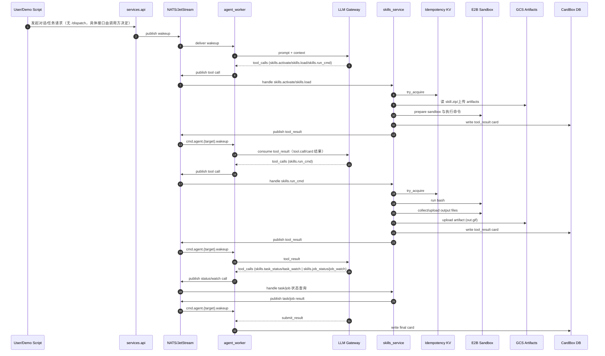

# Skills + E2B 实现说明

本文档说明 skills 与 E2B 的架构、实现细节与测试 Demo。

## 架构

```mermaid
flowchart LR
  subgraph Client
    U[User / Demo Script]
  end

  subgraph API
    A[services.api]
  end

  subgraph Agent
    W[services.agent_worker]
    L[LLM Gateway]
  end

  subgraph Tools
    S[services.tools.skills_service]
  end

  subgraph Infra
    N[NATS / JetStream]
    CB[CardBox DB]
    KV[Idempotency KV]
    GCS[GCS Artifact Storage]
    E2B[E2B Sandbox API]
  end

  U -->|HTTP| A
  A -->|commands| N
  W -->|subscribe| N
  W --> L
  L --> W
  W -->|tool.call 发布: cg.<ver>.<project>.<channel>.cmd.tool.skills.*| N
  N --> S

  S -->|skills.load/skills.activate/技能加载| E2B
  S -->|skills.run_cmd/skills.run_cmd_async/skills.run_service| E2B

  S -->|artifacts read/write| GCS
  N -->|wakeup 回传| W

  S -->|tool_result 卡片写回/report_primitive| CB
  W -->|读取卡片(上下文/tool_result)| CB

  S --> KV
  S --> KV
```

## 调用时序



## 实现细节

### Skill 注入到 Prompt 的水合方式
- `agent_worker` 会把**可用技能列表**注入到系统提示词中（`<available_skills>`），来源于 `resource.skills`，每条只包含 `name/description/location`，不会自动注入 SKILL.md 或源码内容。
- LLM 可以调用的工具清单来自 `resource.tools`，并经过 `profile.allowed_tools` 过滤后注入为标准 OpenAI 工具 spec。
- 内部工具 `submit_result` 由 `profile.allowed_internal_tools` 控制注入；`tool.call` 与 `tool.result` 的闭环通过 `submit_result` 也能完成。

### 注册链路（当前代码实现）
- 项目初始化时会调用 `infra/project_bootstrap.seed_tools`，在 `resource.tools` 中预置如下技能工具：
  `skills.load`、`skills.activate`、`skills.run_cmd`、`skills.run_cmd_async`、`skills.run_service`、`skills.start_job`、`skills.job_status`、`skills.job_cancel`、`skills.job_watch`、`skills.task_status`、`skills.task_cancel`、`skills.task_watch`。
- `POST /projects/{project_id}/skills:upload`（`services/api/main.py`）执行 `SkillService.upload_skill_zip`，解析 `SKILL.md`、上传 zip 到 GCS、创建版本并设置 active 版本。
- 外部工具通过 `POST /projects/{project_id}/tools` 注册到 `resource.tools`，但名字会与内置工具名和 `cmd.sys.*` 目标 subject 做保留校验。
- 仅 `skills.*` 工具走 `services.tools.skills_service`；其订阅主题为 `cg.<ver>.*.*.cmd.tool.skills.*`，队列 `tool_skills`。

### Sandbox 复用与回收
- 默认每次调用创建新 sandbox（`tools.e2b.reuse_mode=none`）。
- 开启复用后，sandbox 按 `project_id + agent_id` 复用，依赖与文件会保留。
- 通过回收服务定期清理过期 sandbox。
 - **自建 E2B 兼容**：优先走 `Sandbox.connect`，若 `/connect` 缺失（404），会 fallback：
   - 读取 `get_info`，若 `state=paused` 则调用 `/sandboxes/{id}/resume`
   - 再次 `get_info`，用 `envdAccessToken + domain` 直接构造 client
   - 该 fallback 已验证可在缺少 `/connect` 的服务端工作


配置示例：
```toml
[tools.e2b]
reuse_mode = "project_agent"
idle_ttl_sec = 1800
hard_ttl_sec = 21600
lock_timeout_sec = 600
reaper_interval_sec = 60
reaper_batch_size = 50
```

启动回收服务：
```bash
uv run -m services.tools.sandbox_reaper
```

### 自建 E2B API 兼容性探测
用于判断服务端是否支持 `/connect`：
```bash
uv run -m scripts.e2b_connect_probe --template pycowsay
```
期望：
- `/connect` 返回 200/201 才代表服务端实现了新 API。
- 若返回 404（no matching operation），说明需依赖 fallback 或补齐服务端路由。

### 排错：execution_edges 索引过长
当 `tool_call_id` 很长时，`state.execution_edges` 的 btree 索引会报：
`index row size ... exceeds btree version 4 maximum ...`
解决方案（已写入 `scripts/setup/init_db.sql`）：
```sql
DROP INDEX IF EXISTS idx_execution_edges_correlation;
DROP INDEX IF EXISTS idx_execution_edges_unique;
CREATE INDEX idx_execution_edges_correlation
  ON state.execution_edges USING hash (correlation_id);
CREATE UNIQUE INDEX idx_execution_edges_unique
  ON state.execution_edges(project_id, md5(correlation_id), primitive, edge_phase);
```
并确保插入逻辑使用：
`ON CONFLICT ON CONSTRAINT idx_execution_edges_unique DO NOTHING`。

### 排错：agent_inbox 索引过长
当 `correlation_id` 很长时，`state.agent_inbox` 的 btree 索引会报：
`index row size ... exceeds btree version 4 maximum ...`
解决方案（已写入 `scripts/setup/init_db.sql`）：
```sql
DROP INDEX IF EXISTS state.idx_agent_inbox_correlation;
DROP INDEX IF EXISTS state.idx_agent_inbox_unique;
CREATE INDEX idx_agent_inbox_correlation
  ON state.agent_inbox USING hash (correlation_id);
CREATE UNIQUE INDEX idx_agent_inbox_unique
  ON state.agent_inbox(project_id, message_type, md5(correlation_id));
```

### 技能执行与依赖安装
- 带 `requirements.txt` 或耗时任务的建议路径：
  - `skills.run_cmd_async`：立即返回 `task_id`，再用 `skills.task_status`/`skills.task_watch` 查询执行状态。
  - `skills.start_job`：适合多步顺序执行（例如安装依赖 -> 运行脚本），并有 `job_status`/`job_watch` 与 `job_cancel`。
- `skills.run_cmd` 为同步调用：默认等待命令结束后返回标准输出、stderr、退出码与 artifacts。
- `skills.load` 会在当前 session 下确保 skill 内容注入到 sandbox（本地 `local` 与远端 `remote` 行为不同）。
- `skills.run_service` 需要 `session_id`，用于长期服务启动场景；仅在 `skills.mode=local` 下可用。

- 使用 `skills.run_cmd` 的示例（短任务）：
  - 会注入 skill 文件到 `skill/`
  - `workdir` 在 `run_cmd` 执行链路固定为 `skill`
  - 可在同一次命令里执行 `pip install -r requirements.txt && python ...`

### 输出文件规则
- 如果设置 `workdir`，输出路径相对该目录解析。
- 例如：`workdir="skill"` + `outputs.path="out.gif"` 实际读取 `skill/out.gif`。

### 端口暴露（Local 模式）
支持在 `skills.run_service` 中通过 `expose_ports` 暴露端口，LLM 仍按 TCP 端口启动服务：

示例：
```json
{
  "skill_name": "web-dev-agent",
  "session_id": "demo",
  "command": "npm run dev -- --port 3000",
  "expose_ports": [3000]
}
```

行为：
- sandbox 内自动启动 sidecar：`TCP:127.0.0.1:3000 -> .srt/ports/3000.sock`
- host 侧自动转发：`.srt/ports/3000.sock -> 127.0.0.1:<host_port>`
- tool.result 会返回 `exposed_endpoints`，包含 `url` 与 `host_port`
- task_status 会返回 `exposed_endpoints_active`，forwarder 被回收后为 `false`
  - 该值是最终一致，forwarder 异常退出时可能会延迟一段时间才变为 `false`

约束：
- 仅支持 `skills.mode=local`
- 依赖系统存在 `socat`，否则报错
- 需在 `config.toml` 的 `[srt.network].allow_unix_sockets` 放行 `.srt/ports/*.sock`
- 若 sandbox-runtime 支持，可设置 `[srt.network].allow_all_unix_sockets = true` 以允许创建 UDS
- `host_port` 优先等于原端口；冲突时自动随机
- 端口映射不会暴露到公网，仅绑定 `127.0.0.1`

### Forwarder/Sandbox Reaper
为避免重启/崩溃导致的 forwarder 与 sandbox 进程残留，`skills_service` 会自动回收：

行为：
- 启动时执行一次 reaper，并启动后台循环（默认 60s）
- 读取 `state.skill_task_heads` 中 `starting/running` 的 task 头
- 校验 `socat` forwarder 的 `cmdline` 与启动时间一致后才会 `SIGTERM`
- 对 local 模式（`provider=srt`）的 sandbox 进程，同样基于 `pid + start_time + settings_path` 校验后回收

安全校验：
- Linux：读取 `/proc/<pid>/cmdline` 与 `/proc/<pid>/stat` 的 `start_time`
- macOS：使用 `ps -o command` 与 `ps -o lstart`

配置：
- `skills.reaper_interval_sec`（默认 60）

## 测试（端到端，自测）

### 1) 启动服务
```bash
docker-compose up -d nats postgres
uv run -m services.api.main
uv run -m services.tools.skills_service
uv run -m services.agent_worker.loop
uv run -m services.pmo.service
uv run -m services.ui_worker.loop
```

### 2) 初始化项目 + 上传 profile + 上传 skill
```bash
PROJECT_ID=public \
SKILL_DIR=examples/skills/slack-gif-creator \
SKILL_NAME=slack-gif-creator \
uv run examples/flows/skills_e2b_bootstrap.py
```

### 3) 用前端触发
在 UI 中输入：
```
帮我生成一个 gif 图，彩色的loading circle
```

## 排错

- tool.result 未返回：确认工具服务已启动且 NATS subject 匹配。
- skills 上传失败：检查 `[gcs]` 配置与凭证。
- agent 未调用工具：检查 LLM key 与 profile 允许的 tool。
- idempotency 卡住：重置 NATS KV：
```bash
uv run scripts/setup/reset_nats_streams.py
```

然后重启工具服务。

## 注意
